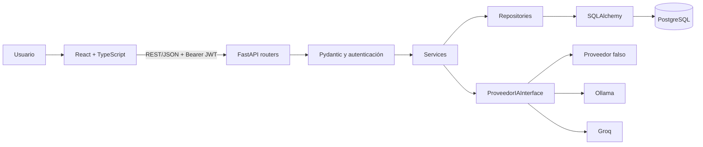
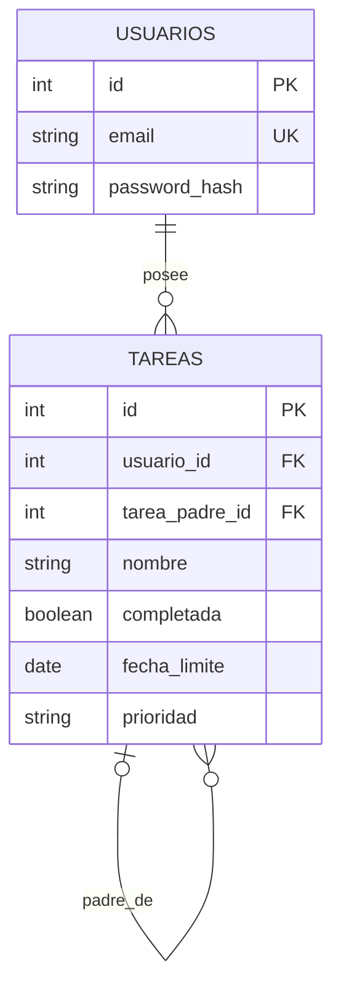
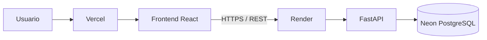
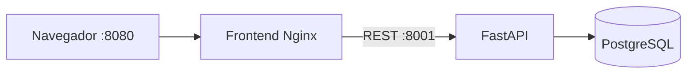

# Gestor de tareas con IA

Aplicación web full-stack para organizar tareas personales y usar IA como asistente de planificación, manteniendo siempre la decisión y la persistencia bajo control del usuario.

[](https://github.com/Ricardoxx07/Gesti-n-de-tareas-IA/actions/workflows/tests.yml)

<!-- TODO: agregar un GIF del flujo principal: registro/inicio de sesión → crear tarea → planificar con IA → revisar y confirmar una propuesta → ver el cambio persistido. -->

## 🚀 Demo

<!-- TODO: agregar URL de producción del frontend. -->
<!-- TODO: agregar URL pública de la API y de Swagger/OpenAPI, si se despliegan. -->

El frontend está desplegado en Vercel, la API FastAPI en Render y PostgreSQL en Neon. Faltan por incorporar a este documento las URLs públicas. No hay una captura o GIF versionados en el repositorio. Para desarrollo local, Docker Compose expone el frontend en `http://localhost:8080` y Swagger en `http://localhost:8001/docs`.

## El problema y la solución

Un gestor de tareas convencional permite guardar pendientes, pero no ayuda a convertir notas informales en un plan accionable, dividir trabajo amplio, decidir qué atender primero ni detectar días con demasiadas entregas.

Este proyecto combina una interfaz web React con una API REST en FastAPI para gestionar tareas y subtareas. La IA puede interpretar texto libre, generar propuestas, recomendar un plan diario, explicar sobrecargas y sugerir reprogramaciones.

El diferenciador es el límite de responsabilidad: **la IA propone, el usuario confirma y el backend persiste**. Una respuesta de un proveedor LLM se trata como dato no confiable; se valida y nunca escribe directamente en PostgreSQL. Las propuestas de creación y de cambio de fechas pasan por una acción explícita de confirmación.

## Características principales

- Registro, inicio y cierre de sesión, restauración de sesión mediante `/auth/me` y rutas protegidas.
- CRUD de tareas con estado, fecha límite y prioridad; gestión de subtareas mediante una relación padre-hija.
- Panel web para transformar lenguaje natural en tareas propuestas y confirmar sólo las seleccionadas.
- Descomposición asistida de una tarea amplia en subtareas, con revisión humana antes de guardarlas.
- Plan diario y recomendaciones priorizadas a partir de las tareas pendientes, sin modificar datos.
- Detección de carga de trabajo por fechas y propuestas de reprogramación que muestran fecha actual, fecha sugerida y motivo antes de confirmarse.
- Prevención de confirmaciones de reprogramación desactualizadas: el backend compara la fecha actual con la fecha usada en la propuesta.
- Manejo consistente de errores de API y proveedor IA, estados de carga, listas vacías, diálogos de confirmación y navegación responsive.

## Stack tecnológico

| Área | Tecnologías y uso |
| --- | --- |
| Frontend | React 19, TypeScript, Vite, React Router, Axios y TanStack Query para la aplicación web y el estado remoto. |
| Formularios y UI | React Hook Form, Zod, Tailwind CSS y Lucide React. |
| Backend | Python 3.14, FastAPI y Pydantic para la API y sus contratos. |
| Datos | PostgreSQL, SQLAlchemy 2 y Alembic para persistencia relacional y migraciones. |
| IA | `ProveedorIAInterface` con implementaciones para proveedor falso determinista, Ollama (`llama3.2:3b`) y Groq. |
| Seguridad | JWT con `python-jose` y hashing de contraseñas Argon2 mediante `pwdlib`. |
| Calidad | pytest, httpx, Vitest, React Testing Library, oxlint y GitHub Actions. |
| Contenedores | Docker, Docker Compose, imágenes de Python/Node/Nginx y PostgreSQL 17 en Compose. |

## Arquitectura



El frontend usa un cliente Axios centralizado, adjunta el JWT cuando existe sesión y consume únicamente la API pública. Los routers FastAPI reciben la petición, resuelven al usuario autenticado y delegan la regla de negocio a los servicios. Los repositorios encapsulan el acceso de SQLAlchemy a PostgreSQL.

Los servicios de IA dependen de una interfaz, no de un proveedor concreto. Las propuestas se validan con modelos Pydantic y con reglas deterministas —por ejemplo, IDs permitidos, orden y contexto de tareas— antes de devolverse. Dentro de los flujos derivados de IA, sólo los endpoints de confirmación llegan a los servicios y repositorios que persisten tareas o fechas.

### Flujo de una propuesta persistible

```text
Usuario escribe una petición
        ↓
React → POST /ia/planificar (o /ia/proponer-reprogramacion)
        ↓
FastAPI autentica, valida y coordina el servicio
        ↓
Proveedor IA devuelve datos estructurados
        ↓
Pydantic + reglas de negocio verifican la respuesta
        ↓
React muestra una propuesta pendiente; el usuario elige qué confirmar
        ↓
POST /ia/propuestas/confirmar o /ia/reprogramaciones/confirmar
        ↓
Service → Repository → PostgreSQL
```

Las rutas de análisis terminan antes de la persistencia. En particular, una reprogramación sólo se aplica si la fecha almacenada todavía coincide con la fecha incluida en la propuesta; si no coincide, la API responde con `409 Conflict`.

## Estructura del proyecto

```text
.
├── frontend/
│   ├── src/
│   │   ├── api/          # Cliente Axios y llamadas a la API
│   │   ├── components/   # Componentes comunes, de tareas e IA
│   │   ├── hooks/        # Autenticación, tareas y mutaciones IA
│   │   ├── pages/        # Pantallas y flujos de usuario
│   │   ├── routes/       # Rutas públicas y protegidas
│   │   ├── schemas/      # Validación de formularios con Zod
│   │   └── types/        # Contratos TypeScript de la API
│   ├── Dockerfile
│   └── vercel.json       # Rewrite para SPA; no acredita un despliegue activo
├── backend/
│   ├── api/              # App FastAPI, dependencias y routers
│   ├── ai/               # Interfaz y proveedores IA
│   ├── services/         # Reglas de negocio y coordinación
│   ├── repository/       # Abstracciones y acceso a SQLAlchemy
│   ├── models/           # Modelos de dominio y persistencia
│   ├── schemas/          # Contratos Pydantic HTTP/IA
│   ├── alembic/          # Migraciones versionadas
│   ├── security/         # JWT y contraseñas
│   └── tests/            # Pruebas unitarias, API e integración
├── .github/workflows/    # Validación continua
├── docker-compose.yaml
└── .env.example
```

## Decisiones técnicas

### Frontend y backend independientes

**Necesidad:** la experiencia de usuario debía funcionar sin Swagger y ambos componentes debían poder desarrollarse y desplegarse por separado.

**Decisión:** una SPA React/Vite en `frontend/` consume la API REST FastAPI mediante Axios; la URL se configura con `VITE_API_URL`.

**Por qué:** separa los contratos HTTP de la implementación interna, permite compilar el frontend de manera autónoma y mantiene PostgreSQL inaccesible desde el navegador.

**Trade-off:** se configuran dos entornos y CORS debe declarar explícitamente los orígenes permitidos.

### Backend organizado por capas

**Necesidad:** evitar que routers HTTP acumulen reglas de dominio y consultas SQL.

**Decisión:** los routers delegan en servicios; los servicios usan repositorios; los repositorios encapsulan SQLAlchemy.

**Por qué:** esta separación facilita probar reglas de negocio y sustituir dependencias de infraestructura sin mezclar responsabilidades.

**Trade-off:** añade archivos y dependencias explícitas frente a una implementación concentrada en los endpoints.

### IA desacoplada y con confirmación humana

**Necesidad:** aprovechar LLMs sin otorgarles autoridad sobre datos persistidos.

**Decisión:** los servicios dependen de `ProveedorIAInterface`; se incluyen proveedores falso, Ollama y Groq. Las respuestas se validan y los cambios requieren endpoints de confirmación.

**Por qué:** permite pruebas deterministas, cambia el proveedor mediante configuración y conserva autorización, validación y persistencia en el backend.

**Trade-off:** el usuario debe realizar un paso adicional de revisión y los flujos de propuesta y confirmación son solicitudes distintas deliberadamente.

### JWT de sesión en el cliente

**Necesidad:** proteger la API y conservar la sesión durante el uso de la SPA.

**Decisión:** el token Bearer se almacena en `sessionStorage`; un interceptor lo adjunta y limpia la sesión ante un `401`.

**Por qué:** el token no persiste al cerrar la sesión del navegador y la lógica de autorización queda centralizada en la API.

**Trade-off:** `sessionStorage` sigue siendo accesible desde JavaScript; una evolución de producción requeriría cookies `HttpOnly`/`Secure` y protección CSRF, con cambios coordinados en el backend.

### Esquema versionado y ejecución reproducible

**Necesidad:** levantar el sistema con una base de datos consistente en desarrollo y CI.

**Decisión:** SQLAlchemy modela la persistencia, Alembic versiona el esquema y Docker Compose inicia PostgreSQL, API y frontend.

**Por qué:** las migraciones se aplican antes de la API en Compose y también se validan en GitHub Actions.

**Trade-off:** se deben configurar variables de entorno y mantener una base exclusiva para las pruebas de integración.

## Seguridad

- Las contraseñas se almacenan con hash Argon2; nunca se devuelven en los contratos de respuesta.
- Los endpoints de tareas e IA resuelven el usuario actual desde el JWT. Las consultas y mutaciones de tareas se filtran por `usuario_id`.
- El JWT incorpora expiración configurable (`JWT_ACCESS_TOKEN_EXPIRE_MINUTES`; 30 minutos por defecto) y usa algoritmo configurable, `HS256` por defecto.
- Pydantic valida entradas HTTP; los esquemas de tareas rechazan campos extra y restringen, entre otros datos, nombre, prioridad e identificadores.
- Las respuestas de IA se vuelven a validar y se comprueban contra el contexto permitido. Errores de respuesta inválida y de proveedor se exponen como errores controlados (`502` y `503`).
- Los secretos, URLs de base de datos y configuración de proveedores viven en `.env`; los archivos `.env` están ignorados por Git. La plantilla `.env.example` no contiene credenciales reales.
- CORS usa `CORS_ORIGINS` como lista explícita y permite las cabeceras/métodos necesarios para JWT; no se configura el comodín `*` junto con credenciales.

## Base de datos

PostgreSQL es la base de datos relacional. SQLAlchemy mapea las entidades y Alembic registra los cambios de esquema: creación de tareas, usuarios, datos de planificación y jerarquía de subtareas.



Una tarea pertenece a un usuario y puede referenciar opcionalmente a otra tarea como padre. La prioridad está restringida a `baja`, `media` o `alta` en el modelo y la base de datos.

## API REST

FastAPI publica contratos interactivos en `/docs` cuando la API está en ejecución.

| Grupo | Propósito |
| --- | --- |
| `/health` | Comprobación simple de disponibilidad de la API. |
| `/auth` | Registro, inicio de sesión y consulta del usuario autenticado. |
| `/tareas` | CRUD de tareas y rutas anidadas para subtareas. |
| `/ia/planificar`, `/ia/descomponer` | Generación de propuestas sin persistencia directa. |
| `/ia/recomendar-tareas`, `/ia/plan-dia` | Priorización y planificación de tareas existentes sin cambios. |
| `/ia/detectar-sobrecarga`, `/ia/proponer-reprogramacion` | Análisis de carga y propuestas de nuevas fechas. |
| `/ia/propuestas/confirmar`, `/ia/reprogramaciones/confirmar` | Únicas rutas IA que crean tareas o aplican fechas tras confirmación. |

## Testing y calidad

El backend tiene pruebas unitarias para servicios, seguridad, interpretación temporal y proveedores; pruebas de API para autenticación, CORS, tareas y flujos IA; y pruebas de integración con los repositorios de PostgreSQL.

El frontend usa Vitest y React Testing Library para cubrir la protección de rutas, ciclo de sesión, formularios, diálogo de confirmación, planner y navegación móvil. Las validaciones de calidad incluyen `oxlint` y compilación de TypeScript/Vite.

El workflow de GitHub Actions se ejecuta en cada `push` y `pull request`:

1. Para el backend, crea un servicio PostgreSQL, instala Python 3.14, ejecuta `alembic upgrade head`, `alembic check` y `pytest`.
2. Para el frontend, instala Node.js 24, ejecuta `npm ci`, `npm run lint`, `npm run build` y `npm test`.

No se publica una métrica de cobertura en el repositorio.

## Despliegue y contenedores

### Arquitectura de producción



El frontend React se publica en Vercel, la API FastAPI se ejecuta en Render y la persistencia se aloja en Neon. La configuración de cada entorno debe suministrar sus URLs, secretos JWT, orígenes CORS y credenciales de base de datos mediante variables de entorno.

### Entorno local con Docker Compose

El repositorio contiene una configuración local reproducible con Docker Compose:



- El frontend se compila en una imagen Node y se sirve desde Nginx.
- La API se construye desde su Dockerfile, espera el healthcheck de PostgreSQL y ejecuta las migraciones antes de iniciar Uvicorn.
- PostgreSQL usa un volumen nombrado (`postgres_data`) para preservar los datos al ejecutar `docker compose down`.
- Compose selecciona por defecto el proveedor IA falso mediante `DOCKER_IA_PROVIDER`, con lo que el entorno local no depende de una LLM externa.

El repositorio también incluye `frontend/vercel.json`, que configura el rewrite de la SPA para Vercel.

## Instalación y ejecución local

### Requisitos

- Git.
- Python 3.14.
- Node.js 24 para reproducir la versión de CI.
- PostgreSQL accesible para ejecución nativa, o Docker y Docker Compose para la alternativa contenida.
- Ollama sólo para usar el proveedor local real; el proveedor `falso` permite usar y probar los flujos sin LLM.

### Inicio rápido con Docker

```bash
git clone https://github.com/Ricardoxx07/Gesti-n-de-tareas-IA.git
cd Gesti-n-de-tareas-IA
cp .env.example .env
cp frontend/.env.example frontend/.env
```

Edita el `.env` de la raíz. Como mínimo, define credenciales seguras de PostgreSQL, `DATABASE_URL`, `TEST_DATABASE_URL`, `JWT_SECRET_KEY` y el proveedor IA. Conserva `TEST_DATABASE_URL` para una base de datos exclusiva de pruebas. Si usarás Docker Compose, incluye `http://localhost:8080` y `http://127.0.0.1:8080` en `CORS_ORIGINS`, además del origen de Vite.

En `frontend/.env`, configura la URL de la API para desarrollo local:

```env
VITE_API_URL=http://localhost:8001
```

Variables relevantes de la raíz:

| Variable | Uso |
| --- | --- |
| `POSTGRES_USER`, `POSTGRES_PASSWORD`, `POSTGRES_DB` | Credenciales y nombre de la base local/contenida. |
| `DATABASE_URL` | Conexión de la API y Alembic. |
| `TEST_DATABASE_URL` | Conexión aislada de pruebas de integración. |
| `JWT_SECRET_KEY`, `JWT_ALGORITHM`, `JWT_ACCESS_TOKEN_EXPIRE_MINUTES` | Firma y vigencia de tokens. |
| `IA_PROVIDER` | `falso`, `ollama` o `groq`. |
| `OLLAMA_*` / `GROQ_*` | Modelo, URL/clave, timeout y límite de tokens del proveedor elegido. |
| `CORS_ORIGINS` | Orígenes de frontend permitidos, separados por comas. |

Con las variables configuradas, inicia el entorno:

```bash
docker compose up --build
```

Servicios disponibles:

- Frontend: `http://localhost:8080`
- API: `http://localhost:8001`
- Swagger/OpenAPI: `http://localhost:8001/docs`

En otra terminal puedes comprobar el estado:

```bash
docker compose ps
docker compose logs api --tail=100
```

Para detener el entorno y conservar el volumen de PostgreSQL:

```bash
docker compose down
```

> Compose usa `DOCKER_IA_PROVIDER=falso` si no se define. Para elegir otro proveedor en Compose, define `DOCKER_IA_PROVIDER` y las variables del proveedor correspondiente; para Ollama local, la ejecución nativa del backend es la opción documentada más directa.

<details>
<summary><strong>Ejecución nativa y proveedores IA</strong></summary>

<br>

Prepara dos bases de datos PostgreSQL: una para la aplicación indicada por `DATABASE_URL` y otra exclusiva para pruebas indicada por `TEST_DATABASE_URL`.

**Backend**

```bash
python -m venv .venv
source .venv/bin/activate
python -m pip install --upgrade pip
python -m pip install -r backend/requirements.txt
cd backend
alembic upgrade head
uvicorn api.main:app --reload --port 8001
```

En Windows, activa el entorno con `.venv\Scripts\Activate.ps1`.

**Frontend**

En otra terminal, desde la raíz del repositorio:

```bash
cd frontend
npm ci
npm run dev
```

Vite mostrará la URL de desarrollo, habitualmente `http://localhost:5173`.

#### Proveedores IA

La opción segura para desarrollo y pruebas es:

```env
IA_PROVIDER=falso
```

Para ejecutar Ollama localmente con la configuración por defecto:

```bash
ollama pull llama3.2:3b
ollama serve
```

Después configura `IA_PROVIDER=ollama` y reinicia Uvicorn. Para Groq, selecciona `IA_PROVIDER=groq` y define `GROQ_API_KEY`; no publiques esa clave.

</details>

### Verificación

**Backend**

```bash
cd backend
python -m pytest -q
```

> Las pruebas crean y eliminan tablas en `TEST_DATABASE_URL`. No apuntes esta variable a una base con información que quieras conservar.

**Frontend**

```bash
cd frontend
npm run lint
npm run build
npm test
```

## 🧩 Retos técnicos abordados

### Integrar IA sin delegar la autoridad de los datos

**Problema:** una respuesta LLM puede ser incompleta, malformada o sugerir identificadores fuera del contexto del usuario.

**Solución:** la interfaz de proveedor mantiene el modelo separado de routers y servicios; Pydantic y los servicios validan estructura, IDs, orden y reglas de negocio. Las rutas de análisis no persisten y las rutas de confirmación son explícitas.

**Resultado:** la aplicación puede cambiar entre proveedor falso, Ollama y Groq sin permitir acceso directo del modelo a PostgreSQL.

### Evitar que una reprogramación obsoleta sobrescriba cambios recientes

**Problema:** entre generar una propuesta y aceptarla, la fecha límite de una tarea puede haber cambiado.

**Solución:** la confirmación recibe la fecha original y el servicio la compara con el valor persistido antes de actualizar.

**Resultado:** un conflicto devuelve `409` en lugar de aplicar una propuesta ya desactualizada.

### Sincronizar autenticación y estado remoto en una SPA

**Problema:** las rutas privadas necesitan validar una sesión restaurada y los cambios persistentes deben reflejarse en la interfaz sin duplicar datos.

**Solución:** `AuthProvider` consulta `/auth/me`; Axios centraliza el token y la gestión de `401`; TanStack Query invalida o actualiza las consultas de tareas tras mutaciones.

**Resultado:** la interfaz redirige ante una sesión inválida y vuelve a consultar el estado del servidor después de crear, editar, confirmar o reprogramar tareas.

## Logros técnicos demostrables

- Aplicación full-stack desplegada: React en Vercel, FastAPI en Render y PostgreSQL en Neon.
- API REST autenticada, con aislamiento por usuario, migraciones relacionales y flujos completos de tareas, subtareas y planificación.
- Integración de IA intercambiable y controlada: las propuestas se validan y requieren confirmación humana antes de persistir.
- Pruebas, lint y compilación automatizados para frontend y backend; ejecución local reproducible con Docker Compose.

## 📚 Aprendizajes aplicados

- Arquitectura por capas, contratos Pydantic e integración de proveedores IA sin ceder reglas de negocio al modelo.
- Estado remoto, rutas protegidas y formularios validados en React/TypeScript.
- Modelado relacional, migraciones, JWT/Argon2, CORS y automatización de pruebas y builds.

## Posibles mejoras futuras

- Añadir una captura o GIF corto del flujo principal en este README.
- Evolucionar a sesiones con cookies `HttpOnly`/`Secure` y protección CSRF mediante cambios compatibles en el backend.
- Incorporar observabilidad de aplicación y proveedor IA, manteniendo fuera de los logs datos sensibles y respuestas crudas.

## Estado

✅ Proyecto finalizado y desplegado en producción: frontend en Vercel, API FastAPI en Render y PostgreSQL en Neon. El repositorio también incluye pruebas, CI y una ejecución local reproducible con Docker Compose.

## Autor

[Ricardoxx07](https://github.com/Ricardoxx07)

## Licencia

<!-- TODO: definir y agregar una licencia para el proyecto. -->
